# Tech Stack

## Overview

This document outlines all technology decisions for the Personalized Job Dashboard, including rationale, architecture, and interview talking points.

### Quick Reference

| Category | Technology | Purpose |
|----------|-----------|---------|
| **Frontend Framework** | React 18+ | UI component library |
| **Build Tool** | Vite | Fast build tool and dev server |
| **Styling** | Tailwind CSS | Utility-first CSS framework |
| **Backend Runtime** | AWS Lambda (Node.js 20.x) | Serverless compute |
| **API Gateway** | AWS API Gateway | REST API management |
| **Database** | AWS DynamoDB | NoSQL data storage |
| **Authentication** | AWS Cognito | User management and auth |
| **Scheduling** | EventBridge Scheduler | Daily/weekly digest triggers |
| **Email** | AWS SES | Email delivery for digests |
| **Frontend Hosting** | S3 + CloudFront | Static site hosting and CDN |
| **Deployment** | AWS SAM | Infrastructure as code |
| **State Management** | React Context API | Client-side state |
| **API Client** | Fetch API | HTTP requests |
| **Form Handling** | React Hook Form | Form state management |

### Architecture Diagram

```mermaid
graph TB
    User[User Browser] --> CloudFront[CloudFront CDN]
    CloudFront --> S3[S3 Bucket<br/>React App]
    
    User --> Cognito[AWS Cognito<br/>Authentication]
    
    S3 --> API[API Gateway<br/>REST Endpoints]
    Cognito --> API
    
    API --> Lambda1[Lambda: Create Job]
    API --> Lambda2[Lambda: Get Jobs]
    API --> Lambda3[Lambda: Update Job]
    API --> Lambda4[Lambda: Delete Job]
    API --> Lambda5[Lambda: Auth Handler]
    
    Lambda1 --> DynamoDB[(DynamoDB<br/>Jobs Table)]
    Lambda2 --> DynamoDB
    Lambda3 --> DynamoDB
    Lambda4 --> DynamoDB
    
    EventBridge[EventBridge Scheduler<br/>Daily Trigger] --> Lambda6[Lambda: Digest Generator]
    Lambda6 --> DynamoDB
    Lambda6 --> SES[AWS SES<br/>Email Delivery]
    SES --> User
    
    style DynamoDB fill:#4A90E2
    style Lambda1 fill:#FF9900
    style Lambda2 fill:#FF9900
    style Lambda3 fill:#FF9900
    style Lambda4 fill:#FF9900
    style Lambda5 fill:#FF9900
    style Lambda6 fill:#FF9900
    style Cognito fill:#232F3E
    style S3 fill:#569A31
    style CloudFront fill:#569A31
```



## Frontend Stack

### React

**Version:** 18.x or latest stable

**Why Chosen:**
- Industry standard for modern web applications
- Large ecosystem and community support
- Component-based architecture fits job tracking UI
- Excellent developer experience with hooks and modern patterns
- Easy to explain in interviews (widely understood)

**Key Libraries:**
- React Router (for navigation if needed)
- React Context API (for state management)
- React Hook Form (for form handling)

### Vite

**Why Chosen Over Next.js:**
- **Simplicity**: No SSR complexity needed for this SPA
- **Speed**: Lightning-fast HMR and build times
- **Lightweight**: Minimal configuration, faster dev experience
- **Focus**: This is a dashboard app, not a content site - SSR not required
- **Learning**: Easier to understand build process for interview explanations

**Benefits:**
- Instant server start
- Fast HMR (Hot Module Replacement)
- Optimized production builds
- Native ES modules support

### Tailwind CSS

**Why Chosen:**
- Rapid UI development with utility classes
- Consistent design system
- Small production bundle size (purging unused styles)
- No CSS file management overhead
- Modern, professional look with minimal effort

**Setup:**
- Configured via `tailwind.config.js`
- JIT (Just-In-Time) mode enabled
- Custom color palette for job status indicators

## Backend Stack

### AWS Lambda

**Runtime:** Node.js 20.x

**Why Node.js:**
- JavaScript/TypeScript consistency across frontend and backend
- Large ecosystem of AWS SDK and libraries
- Fast cold starts
- Good for JSON-heavy APIs (DynamoDB interactions)
- Easy to find examples and documentation

**Function Structure:**
- One Lambda per API endpoint (Create, Read, Update, Delete)
- Shared code in Lambda layers if needed
- Environment variables for configuration
- IAM roles for DynamoDB and other AWS service access

**Key Patterns:**
- Handler functions return proper HTTP responses
- Error handling with try/catch
- Input validation
- User context from Cognito JWT tokens

### API Gateway

**Type:** REST API

**Endpoints Structure:**
```
POST   /jobs           - Create new job application
GET    /jobs           - Get all jobs for user
GET    /jobs/{id}      - Get specific job
PUT    /jobs/{id}      - Update job
DELETE /jobs/{id}      - Delete job
POST   /auth/login     - User login (handled by Cognito)
POST   /auth/signup    - User signup (handled by Cognito)
```

**Features:**
- CORS configuration for frontend
- Request validation
- Integration with Lambda functions
- Authentication via Cognito authorizers
- Rate limiting (if needed)

### DynamoDB

**Why DynamoDB Over Postgres:**
- **Serverless**: No server management, auto-scaling
- **AWS Native**: Seamless integration with Lambda and Cognito
- **Cost**: Pay per request, very cheap for personal use
- **Performance**: Single-digit millisecond latency
- **Scalability**: Handles scale automatically
- **Interview Value**: Demonstrates understanding of NoSQL and AWS services

**Table Design:**

**Primary Table: `jobs`**
- **Partition Key:** `userId` (Cognito user ID)
- **Sort Key:** `jobId` (UUID)
- **Attributes:**
  - `company`, `role`, `locationType`, `status`
  - `appliedDate`, `followupDate`, `jobUrl`
  - `contactName`, `notes`
  - `createdAt`, `updatedAt`

**Global Secondary Indexes (GSI):**
- `status-index`: Query by status (for filtering)
- `followupDate-index`: Query by followup date (for digest Lambda)

**Access Patterns:**
1. Get all jobs for a user: Query by `userId`
2. Get job by ID: GetItem with `userId` + `jobId`
3. Filter by status: Query GSI `status-index`
4. Find overdue follow-ups: Query GSI `followupDate-index` with date filter

### AWS Cognito

**Why Chosen:**
- Fully managed authentication service
- Integrates seamlessly with API Gateway
- User pools for email/password auth
- JWT tokens for API authorization
- No need to build auth from scratch

**Setup:**
- User Pool with email/password signup
- App Client for frontend integration
- Lambda authorizer for API Gateway
- User data isolation (each user only sees their jobs)

**Authentication Flow:**
1. User signs up/logs in via Cognito
2. Cognito returns JWT tokens (ID token, Access token)
3. Frontend stores tokens (localStorage or secure cookie)
4. API requests include JWT in Authorization header
5. API Gateway validates token via Cognito authorizer
6. Lambda receives user context (userId from token)

## AWS Services Breakdown

### Core Services

**AWS Lambda**
- Serverless compute for all API logic
- Event-driven architecture
- Auto-scaling based on request volume
- Pay only for execution time

**API Gateway**
- REST API endpoint management
- Request routing to Lambda functions
- Authentication and authorization
- Request/response transformation
- CORS handling

**DynamoDB**
- Primary data storage
- NoSQL database optimized for single-table design
- Global Secondary Indexes for query flexibility
- On-demand billing (pay per request)

**AWS Cognito**
- User authentication and management
- User pools for signup/login
- JWT token generation and validation
- Password reset and email verification

### Automation Services

**EventBridge Scheduler**
- Daily trigger at specified time (e.g., 9 AM)
- Invokes digest Lambda function
- No infrastructure to manage
- Reliable scheduling

**Lambda (Digest Function)**
- Queries DynamoDB for overdue follow-ups
- Generates summary email content
- Sends email via SES
- Logs activity for monitoring

### Communication Services

**AWS SES (Simple Email Service)**
- Sends digest emails to user
- Low cost for personal use
- Reliable delivery
- Easy to configure

### Hosting Services

**S3 (Simple Storage Service)**
- Hosts static React build files
- Versioning enabled for rollbacks
- Public read access for website

**CloudFront**
- CDN for fast global delivery
- HTTPS termination
- Custom domain support
- Caching for performance

## Data Storage

### DynamoDB Table Structure

**Table Name:** `jobs`

**Primary Key:**
- Partition Key: `userId` (String) - Cognito user ID
- Sort Key: `jobId` (String) - UUID

**Attributes:**
```typescript
{
  userId: string,           // Partition key
  jobId: string,            // Sort key
  company: string,
  role: string,
  locationType: string,     // "remote" | "hybrid" | "onsite"
  status: string,          // "applied" | "interviewing" | "rejected" | "offer"
  appliedDate: string,      // ISO date string
  followupDate: string | null, // ISO date string
  jobUrl: string,
  contactName: string | null,
  notes: string | null,
  createdAt: string,        // ISO timestamp
  updatedAt: string         // ISO timestamp
}
```

### Global Secondary Indexes

**GSI 1: `status-index`**
- Partition Key: `userId`
- Sort Key: `status`
- Purpose: Filter jobs by status (applied, interviewing, etc.)

**GSI 2: `followupDate-index`**
- Partition Key: `userId`
- Sort Key: `followupDate`
- Purpose: Query overdue follow-ups for digest emails

### Access Patterns

1. **Get all jobs for user**
   - Query `jobs` table with `userId` as partition key
   - Returns all jobs sorted by `jobId`

2. **Get job by ID**
   - GetItem with `userId` + `jobId`
   - Direct access, O(1) lookup

3. **Filter by status**
   - Query `status-index` GSI
   - Partition key: `userId`, Sort key: `status`

4. **Find overdue follow-ups**
   - Query `followupDate-index` GSI
   - Partition key: `userId`
   - Filter: `followupDate < today AND status IN ('applied', 'interviewing')`

## Authentication Flow

### Cognito User Pool Setup

1. **User Pool Configuration**
   - Email as username
   - Password policy (min 8 chars, complexity requirements)
   - Email verification required
   - Self-service signup enabled

2. **App Client**
   - Public client (no client secret)
   - OAuth flows: Authorization code grant
   - Allowed callback URLs: Frontend domain
   - Allowed sign-out URLs: Frontend domain

### Frontend Integration

1. **Sign Up Flow**
   - User enters email and password
   - Frontend calls Cognito SignUp API
   - Cognito sends verification email
   - User verifies email
   - User can now log in

2. **Login Flow**
   - User enters email and password
   - Frontend calls Cognito SignIn API
   - Cognito returns JWT tokens (ID token, Access token, Refresh token)
   - Frontend stores tokens securely
   - Redirect to dashboard

3. **API Request Flow**
   - Frontend includes Access token in Authorization header
   - API Gateway validates token via Cognito authorizer
   - Lambda receives user context (userId from token claims)
   - Lambda uses userId to query DynamoDB

### Protected API Routes

All `/jobs/*` endpoints require authentication:
- API Gateway uses Cognito User Pool authorizer
- Validates JWT token on every request
- Extracts `sub` (user ID) from token claims
- Passes user context to Lambda

### User Data Isolation

- Every DynamoDB query includes `userId` as partition key
- Users can only access their own data
- No cross-user data leakage possible
- Enforced at database level, not just application level

## Deployment Strategy

### Frontend Deployment

**S3 + CloudFront**

**Why S3 + CloudFront Over Vercel:**
- Keeps everything in AWS ecosystem (good for interview)
- Demonstrates understanding of AWS services
- More control over hosting configuration
- Cost-effective for personal projects
- Learning opportunity for AWS services

**Deployment Steps:**
1. Build React app: `npm run build`
2. Upload `dist/` contents to S3 bucket
3. Configure S3 bucket for static website hosting
4. Create CloudFront distribution pointing to S3
5. Configure custom domain (optional)
6. Set up SSL certificate via ACM (AWS Certificate Manager)

**Alternative:** Vercel (faster setup, but less AWS learning)

### Backend Deployment

**AWS SAM (Serverless Application Model)**

**Why SAM:**
- AWS-native tool (good for learning)
- Simple YAML configuration
- Easy local testing with `sam local`
- Good documentation and examples
- Integrates well with other AWS services

**SAM Template Structure:**
```yaml
Resources:
  JobsTable:
    Type: AWS::DynamoDB::Table
    Properties: ...
  
  CreateJobFunction:
    Type: AWS::Serverless::Function
    Properties: ...
  
  JobsApi:
    Type: AWS::Serverless::Api
    Properties: ...
```

**Deployment Steps:**
1. Define infrastructure in `template.yaml`
2. Build: `sam build`
3. Test locally: `sam local start-api`
4. Deploy: `sam deploy --guided` (first time)
5. Subsequent deploys: `sam deploy`

**Alternatives:**
- Serverless Framework (more plugins, larger community)
- AWS CDK (TypeScript/JavaScript, more powerful but complex)

### Environment Management

- **Development:** Local DynamoDB, local Lambda testing
- **Production:** AWS resources, environment variables in SAM template
- **Secrets:** AWS Secrets Manager or Parameter Store (if needed)
- **Configuration:** Environment variables in Lambda functions

## Tradeoffs & Decisions

### Why AWS Over Supabase

**Decision:** Full AWS stack

**Rationale:**
- **Interview Value**: Demonstrates deep AWS knowledge
- **Full Control**: Complete control over infrastructure
- **Learning**: Better understanding of individual AWS services
- **Scalability**: Can scale each component independently
- **Cost**: Pay-per-use model, very cheap for personal use
- **Resume**: Shows ability to work with enterprise-grade cloud services

**Tradeoffs:**
- More setup complexity (vs Supabase's simplicity)
- More services to learn and manage
- More potential points of failure
- Steeper learning curve

### Why DynamoDB Over Postgres

**Decision:** DynamoDB

**Rationale:**
- **Serverless**: No database server to manage
- **AWS Native**: Seamless integration with Lambda and Cognito
- **Cost**: Very cheap for low-traffic personal app
- **Performance**: Single-digit millisecond latency
- **Auto-scaling**: Handles traffic spikes automatically
- **Interview Value**: Shows NoSQL database knowledge

**Tradeoffs:**
- Less flexible querying (no complex joins)
- Learning curve for NoSQL data modeling
- Less familiar than SQL for most developers
- Requires careful index design

### Why Vite Over Next.js

**Decision:** Vite

**Rationale:**
- **Simplicity**: No SSR complexity needed for dashboard app
- **Speed**: Faster dev server and builds
- **Focus**: This is a SPA, not a content site
- **Learning**: Easier to understand build process
- **Bundle Size**: Smaller production bundles

**Tradeoffs:**
- No SSR/SSG benefits (not needed here)
- No built-in routing (need React Router if needed)
- Less "batteries included" than Next.js

### Why Lambda Over Traditional Server

**Decision:** AWS Lambda

**Rationale:**
- **Cost**: Pay only for execution time (very cheap for personal use)
- **Scalability**: Auto-scales from 0 to thousands of requests
- **No Ops**: No server management, patching, or monitoring
- **Event-Driven**: Perfect for API endpoints
- **Interview Value**: Demonstrates serverless architecture knowledge

**Tradeoffs:**
- Cold start latency (mitigated by provisioned concurrency if needed)
- 15-minute execution limit (not an issue for API endpoints)
- Less control over runtime environment
- Debugging can be more challenging

## Interview Talking Points

### Architecture Decisions

**"Why did you choose a serverless architecture?"**
- Cost-effective for personal projects (pay per request)
- Auto-scaling handles traffic spikes automatically
- No server management overhead
- Demonstrates modern cloud-native patterns
- Good learning opportunity for AWS services

**"How did you handle authentication?"**
- AWS Cognito for managed authentication
- JWT tokens for stateless API authorization
- User data isolation at database level (DynamoDB partition keys)
- Secure token storage in frontend

**"Why DynamoDB over a relational database?"**
- Serverless, no database server to manage
- Fast, single-digit millisecond latency
- Auto-scaling for unpredictable traffic
- Cost-effective for personal use
- Good fit for single-user data model (userId as partition key)

### Challenges Faced and Solutions

**Challenge 1: DynamoDB Data Modeling**
- **Problem**: Coming from SQL background, NoSQL modeling was unfamiliar
- **Solution**: Studied single-table design patterns, designed access patterns first, then modeled table structure
- **Learning**: NoSQL requires thinking about queries upfront, not just data structure

**Challenge 2: API Gateway CORS Configuration**
- **Problem**: CORS errors when frontend called API
- **Solution**: Configured CORS headers in API Gateway, added OPTIONS method handling
- **Learning**: API Gateway requires explicit CORS configuration

**Challenge 3: Lambda Cold Starts**
- **Problem**: First request after idle period was slow
- **Solution**: Used provisioned concurrency for critical functions (if needed), optimized Lambda package size
- **Learning**: Serverless has tradeoffs, but benefits outweigh costs for this use case

### What You'd Do Differently Next Time

1. **Start with Infrastructure as Code Earlier**
   - Set up SAM template from day one
   - Makes deployments and rollbacks easier
   - Better version control of infrastructure

2. **More Comprehensive Error Handling**
   - Standardized error response format
   - Better error logging and monitoring
   - User-friendly error messages

3. **Add Monitoring Earlier**
   - CloudWatch dashboards for Lambda metrics
   - Alarms for errors and latency
   - Better observability from the start

4. **Consider TypeScript**
   - Type safety across frontend and backend
   - Better IDE support and refactoring
   - Catches errors at compile time

### Scalability Considerations

**Current Scale:**
- Single user (personal dashboard)
- Low request volume
- Small data set

**How It Scales:**
- **Users**: DynamoDB partition key (userId) allows unlimited users
- **Requests**: Lambda auto-scales to handle traffic spikes
- **Data**: DynamoDB handles millions of items per partition
- **Cost**: Scales linearly with usage (pay per request)

**If Scaling to Thousands of Users:**
- Add CloudWatch monitoring and alarms
- Consider DynamoDB on-demand vs provisioned capacity
- Add caching layer (ElastiCache) if needed
- Implement rate limiting in API Gateway
- Add CloudFront caching for static assets
- Consider Lambda provisioned concurrency for critical paths

## Alternatives Considered

### Supabase

**What It Is:** Backend-as-a-Service with Postgres, Auth, and Storage

**Why Not Chosen:**
- Wanted full AWS experience for interview value
- Prefer to understand individual services deeply
- More control over infrastructure
- Better for demonstrating AWS knowledge

**When It Would Be Better:**
- Faster MVP development
- Team prefers SQL over NoSQL
- Need real-time features (Supabase has built-in subscriptions)
- Want less infrastructure management

### Next.js

**What It Is:** React framework with SSR, SSG, and routing

**Why Not Chosen:**
- This is a SPA dashboard, no SSR needed
- Vite is faster for development
- Simpler build process
- Less complexity for this use case

**When It Would Be Better:**
- Need SEO optimization
- Want server-side rendering
- Building a content-heavy site
- Need API routes in same codebase

### Postgres (RDS)

**What It Is:** Managed relational database on AWS

**Why Not Chosen:**
- DynamoDB is serverless (no server management)
- Better cost for low-traffic personal app
- Faster for simple queries (single-digit ms)
- NoSQL fits the data model (user-partitioned data)

**When It Would Be Better:**
- Need complex queries and joins
- Team more familiar with SQL
- Need ACID transactions across multiple tables
- Complex relational data model

## Additional Technology Decisions

### State Management: React Context API

**Decision:** Built-in Context API (no external library)

**Rationale:**
- Simple state needs (user auth, job list)
- No need for complex state management
- Reduces dependencies
- Easy to understand and explain

**If Needed Later:** Can migrate to Zustand or Redux if state becomes complex

### API Client: Fetch API

**Decision:** Native Fetch API

**Rationale:**
- Built into browsers, no dependencies
- Modern, promise-based API
- Sufficient for this use case
- Smaller bundle size

**Alternative:** Axios (more features, but adds dependency)

### Form Handling: React Hook Form

**Decision:** React Hook Form

**Rationale:**
- Popular, well-maintained library
- Performant (minimal re-renders)
- Good TypeScript support
- Easy to integrate with validation

**Alternative:** Formik (more established, but heavier)

## Summary

This tech stack prioritizes:
1. **AWS Learning**: Full AWS stack for interview value
2. **Simplicity**: Vite, Context API, Fetch (minimal dependencies)
3. **Serverless**: Lambda, DynamoDB, Cognito (no infrastructure management)
4. **Cost-Effective**: Pay-per-use model, very cheap for personal use
5. **Modern**: React 18, Node.js 20, latest best practices

The stack is designed to be:
- **Interview-Ready**: Demonstrates AWS knowledge and modern patterns
- **Maintainable**: Simple, well-documented, easy to understand
- **Scalable**: Can handle growth without major refactoring
- **Cost-Effective**: Minimal cost for personal use, scales with usage

